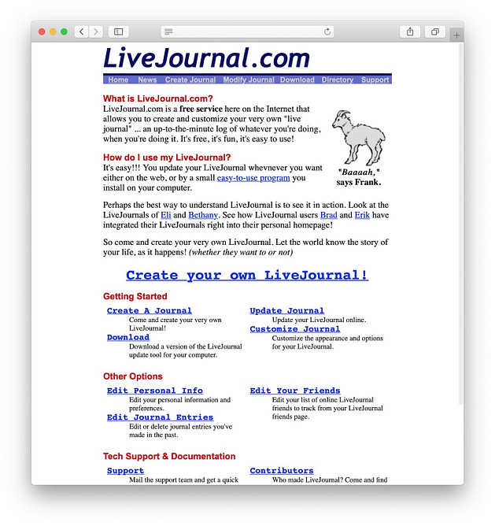

## 

**Cheap clone just for fun**

_Also, you can choose other languages! : [English](README.md), [Español](README.es.md)_

## Objective:

Use TailwindCSS and some Typescript to make a clone of, I suppose home page of Live Journal,  
somewhere in the 2000s, in one night.

## Image of guide

**[Image of Source](https://themeisle.com/blog/history-of-blogging/)**

## Link

:arrow_right: [Here you go](https://oh-hi.vercel.app/)
